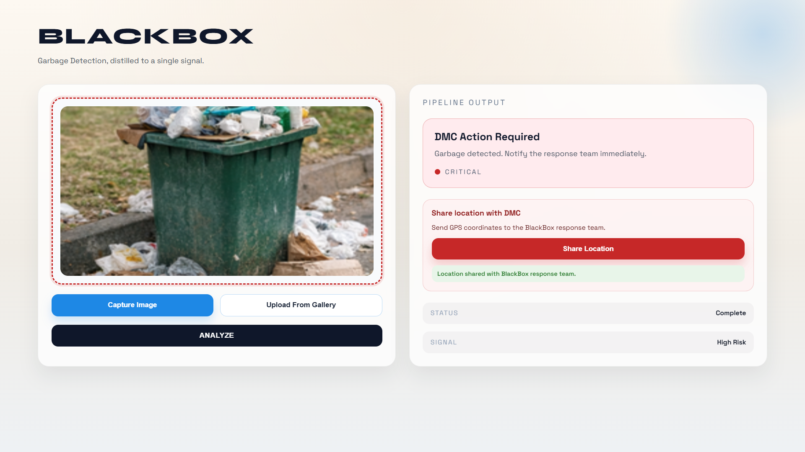
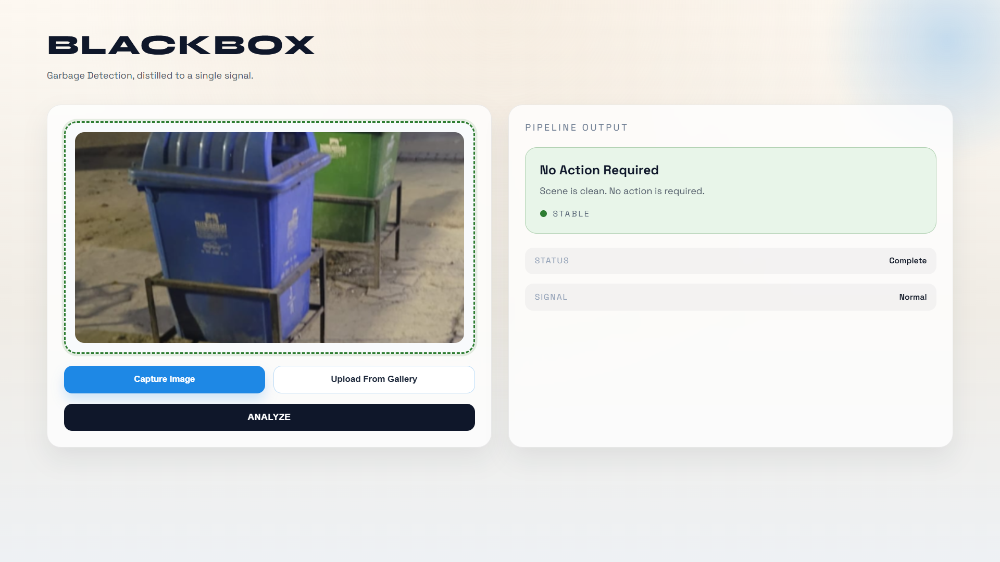

# BlackBox

Garbage overflow detection system using YOLO models and XGBoost classification.

## How it works

Analyzes images to detect garbage and determine if action is required.

Upload or capture a photo. The system runs it through two YOLO models (object detection and garbage classification) and an XGBoost classifier. Returns one of two states:

- **DMC Action Required**: Garbage overflow detected
- **No Action Required**: Scene is clean

## Feature - Location Sharing

When garbage is detected, you can share your GPS location with the response team. The app captures:
- Latitude and longitude
- GPS accuracy
- Detection result
- Timestamp

Data is sent to the backend `/notify` endpoint.

## Setup

See SETUP.md for installation and running instructions. 

(P.S. couldn't deploy since PyTorch was too heavy for free tiers and I was out of GCP credits 😅. Works fine locally though.)

## Frontend

## API

POST `/predict` - Send image for analysis
POST `/notify` - Store location and detection result

